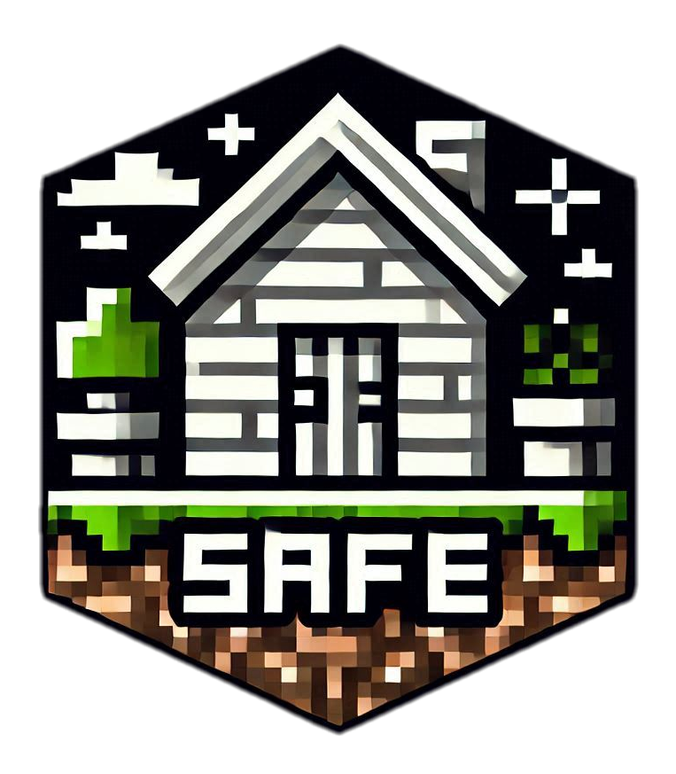

# Safe Villages

A Minecraft Bedrock Edition addon that makes villages safer by preventing hostile mobs from spawning nearby.

## Description

This addon enhances the safety of villages by automatically killing hostile mobs that spawn within a certain radius (currently 32 blocks) of a village. This is particularly helpful for players who prefer a less challenging experience around villages, bridging the gap between "peaceful" and "easy" difficulty levels.

## How it Works

The addon listens for entity spawn events. When a hostile mob (like zombies, skeletons, creepers, etc.) spawns, the addon checks if it's within 32 blocks of any villager or iron golem. If it is, the mob is instantly killed, preventing it from ever reaching the village.

## Installation

1.  Download the `.mcpack` file from the [Releases](https://github.com/thani-sh/safer-villages/releases) page (link to be added).
2.  Open the `.mcpack` file with Minecraft Bedrock Edition. It should automatically import the addon.
3.  Activate the Behavior Pack in your world settings.

## License

This project is licensed under the MIT License - see the [LICENSE](LICENSE) file for details.

## Contributing

Contributions are welcome! If you'd like to contribute to this project, please follow these steps:

1.  **Fork the repository.**
2.  **Set up your development environment:**
    - We recommend using [Bridge](https://bridge-core.app/) IDE.
    - Clone your forked repository to your computer.
    - Open the project folder in Bridge.
3.  **Make your changes:**
    - Create a new branch for your feature or bug fix.
    - Implement your changes in the relevant files (primarily `scripts/main.js`).
4.  **Test your changes:**
    - Ensure your changes work correctly in Minecraft Bedrock Edition.
5.  **Open a Pull Request:**
    - Go to the original repository on GitHub.
    - Click on "New Pull Request".
    - Provide a clear title and description for your changes.

Please ensure your code follows the existing style and that your changes are well-documented.
