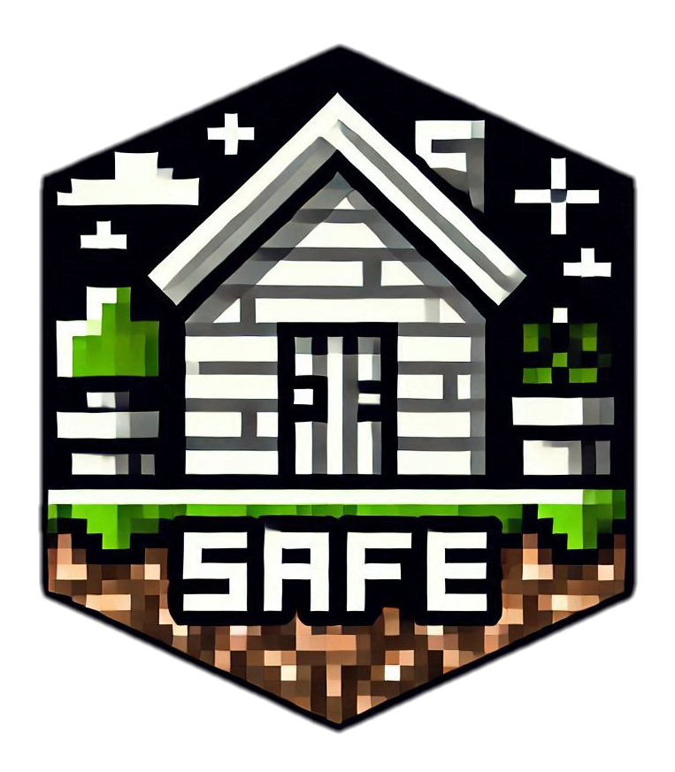

# Safe Villages

A Minecraft Bedrock Edition addon that makes villages safer by preventing hostile mobs from spawning nearby.

## Description

This addon enhances the safety of villages by automatically killing hostile mobs that spawn within a certain radius (currently 32 blocks) of a village. This is particularly helpful for players who prefer a less challenging experience around villages, bridging the gap between "peaceful" and "easy" difficulty levels.

## How it Works

The addon listens for entity spawn events. When a hostile mob (like zombies, skeletons, creepers, etc.) spawns, the addon checks whether it is within 32 blocks of any villager or iron golem, or of a village marker block — a bed or a bell — since a house can stand empty of villagers while still being part of the village. If it is, the mob is instantly killed, preventing it from ever reaching the village.

## Installation

1.  Download the `.mcpack` file from the [Releases](https://github.com/thani-sh/safer-villages/releases) page (link to be added).
2.  Open the `.mcpack` file with Minecraft Bedrock Edition. It should automatically import the addon.
3.  Activate the Behavior Pack in your world settings.

## Dedicated Server Setup

This addon is a behaviour pack with a script module, so it runs entirely server-side: players do not need to install anything, and there is no resource pack to distribute.

### Requirements

- Bedrock Dedicated Server (BDS) **1.21.50 or newer** (December 2024). The pack depends on `@minecraft/server` `1.16.0`, and that stable API version shipped with 1.21.50 — older builds cannot load the script module. The manifest's `min_engine_version` states the same floor, so an older server rejects the pack with a clear version error instead of silently failing to load the script.
- **No experiments needed.** `@minecraft/server` `1.16.0` is a release version rather than a beta, so the "Beta APIs" toggle stays off.

### Install

1.  **Get the pack folder.** Clone this repository, or rename the release `.mcpack` to `.zip`, extract it, and keep the folder containing `manifest.json`.
2.  **Start the server once** if you haven't already, so that `worlds/<level-name>/` exists. `<level-name>` comes from `server.properties` (default: `Bedrock level`).
3.  **Copy the pack folder into the server's behaviour packs directory:**

    ```text
    <server>/
    ├── behavior_packs/
    │   └── safe-villages/        <- the folder from step 1
    │       ├── manifest.json
    │       ├── pack_icon.png
    │       └── scripts/main.js
    ├── server.properties
    └── worlds/
        └── Bedrock level/
            └── world_behavior_packs.json
    ```

4.  **Activate it for your world.** Edit `worlds/<level-name>/world_behavior_packs.json`, creating it if it doesn't exist. Use `header.uuid` and `header.version` from `manifest.json` — the header UUID, not a module UUID:

    ```json
    [
      {
        "pack_id": "e51dd8c9-09c2-47bc-80da-3abb26ebd72c",
        "version": [1, 0, 0]
      }
    ]
    ```

    If the file already lists packs, add this object to the existing array. Order matters: later entries win where content overlaps.

5.  **Restart the server** and watch the console for pack-loading errors.
6.  **Confirm it is running.** Add `content-log-file-enabled=true` to `server.properties` and restart — the addon's `console.log` lines (`SafeVillage: ...`) then appear in the content log in the server root. In game, walk into a village at night: hostile mobs should vanish as they spawn.

### Changing the radius

The radius lives in `VILLAGE_RADIUS_BLOCKS` in `scripts/main.js` (currently `32`). Edit it, copy the pack folder back, and restart the server — there is no build step, BDS reads `scripts/main.js` directly.

### Troubleshooting

- **Pack does not load** — the folder must sit directly inside `behavior_packs/`, not nested a level deeper, and `pack_id` must match `manifest.json`'s `header.uuid` exactly.
- **"Pack requires a newer version"** — update BDS to at least the version noted under Requirements.
- **Script errors on startup** — set `content-log-file-enabled=true`; the details are written to the content log in the server root.

## Contributing

Contributions are welcome! If you'd like to contribute to this project, please follow these steps:

1.  **Fork the repository.**
2.  **Set up your development environment:**
    - We recommend using [Bridge](https://bridge-core.app/) IDE.
    - Clone your forked repository to your computer.
    - Open the project folder in Bridge.
3.  **Make your changes:**
    - Create a new branch for your feature or bug fix.
    - Implement your changes in the relevant files (primarily `scripts/main.js`).
4.  **Test your changes:**
    - Ensure your changes work correctly in Minecraft Bedrock Edition.
5.  **Open a Pull Request:**
    - Go to the original repository on GitHub.
    - Click on "New Pull Request".
    - Provide a clear title and description for your changes.

Please ensure your code follows the existing style and that your changes are well-documented.

## License

This project is licensed under the MIT License - see the [LICENSE](LICENSE) file for details.
